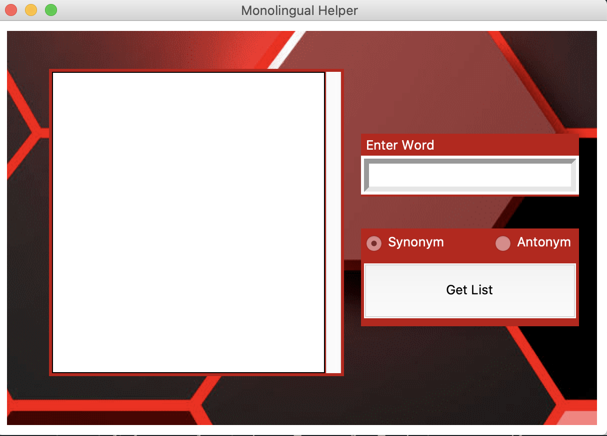
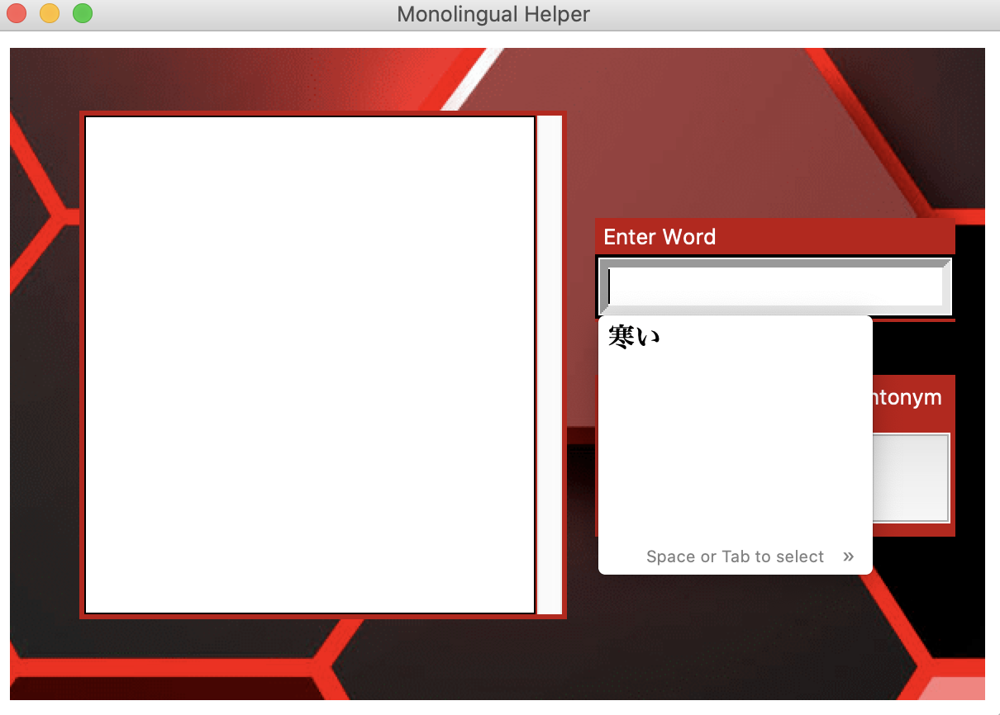
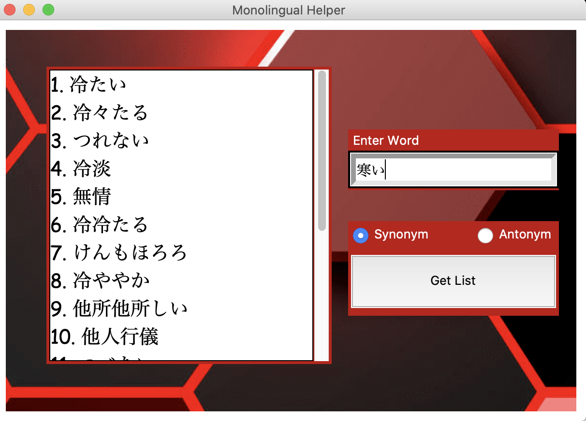

# Japanese Monlingual Helper 

> Monolingual Helper 

---

### Table of Contents

- [Description](#description)
- [How To Use](#how-to-use)
- [References](#references)
- [License](#license)
- [Known bugs](#known-bugs)

---

## Description

The Japanese Monolingual helper is a web scraper that takes Japanese words and returns the synonym or the antonym. What this does is assist learners in their journey to switch over to monolingual by referencing new words with words that they are more familiar with. That way they can learn their target language with their target language 

#### Technologies

- Python 3.8
- Pycharm

[Back To The Top](#read-me-template)

---

## How To Use

#### Installation

pip install python3.8

#### Instuctions:

1. Once you clone or download the project, make sure that you are running python 3.8 or higher.

2. When you are ready to run the program, run the program from **controller.py**

3. This Should be the window that pops up.

   
4. Next, Click inside the text field and enter a Japanese word's base form. 

   
5. NOTE: If the japanese word you have chosen doesn't seem to appear in the text feild after selection press enter again and the word should appear. Choose either Synonym or Antonym and click the Big Button.

6. The data should appear in the box to the left. You should be able to scroll the data as you would like. 

   

   

[Back To The Top](#read-me-template)

---

## References

www.freepik.com

https://thesaurus.weblio.jp/

[Back To The Top](#read-me-template)

---

## License

MIT License

Copyright (c) [2020] [Cyphrin]

Permission is hereby granted, free of charge, to any person obtaining a copy
of this software and associated documentation files (the "Software"), to deal
in the Software without restriction, including without limitation the rights
to use, copy, modify, merge, publish, distribute, sublicense, and/or sell
copies of the Software, and to permit persons to whom the Software is
furnished to do so, subject to the following conditions:

The above copyright notice and this permission notice shall be included in all
copies or substantial portions of the Software.

THE SOFTWARE IS PROVIDED "AS IS", WITHOUT WARRANTY OF ANY KIND, EXPRESS OR
IMPLIED, INCLUDING BUT NOT LIMITED TO THE WARRANTIES OF MERCHANTABILITY,
FITNESS FOR A PARTICULAR PURPOSE AND NONINFRINGEMENT. IN NO EVENT SHALL THE
AUTHORS OR COPYRIGHT HOLDERS BE LIABLE FOR ANY CLAIM, DAMAGES OR OTHER
LIABILITY, WHETHER IN AN ACTION OF CONTRACT, TORT OR OTHERWISE, ARISING FROM,
OUT OF OR IN CONNECTION WITH THE SOFTWARE OR THE USE OR OTHER DEALINGS IN THE
SOFTWARE.

[Back To The Top](#read-me-template)

---

## Known Bugs

- 

[Back To The Top](
